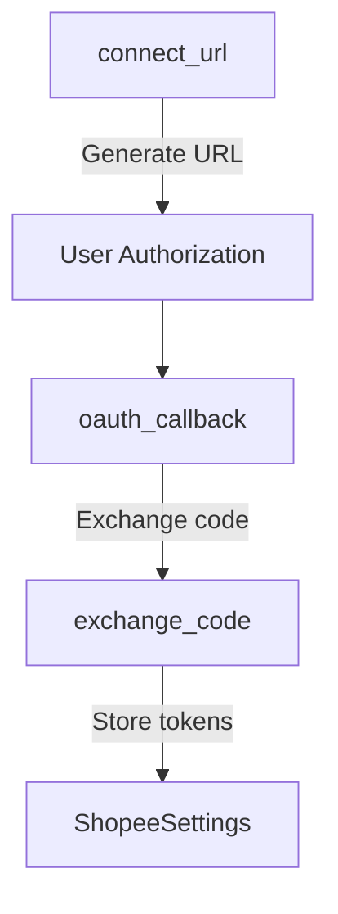
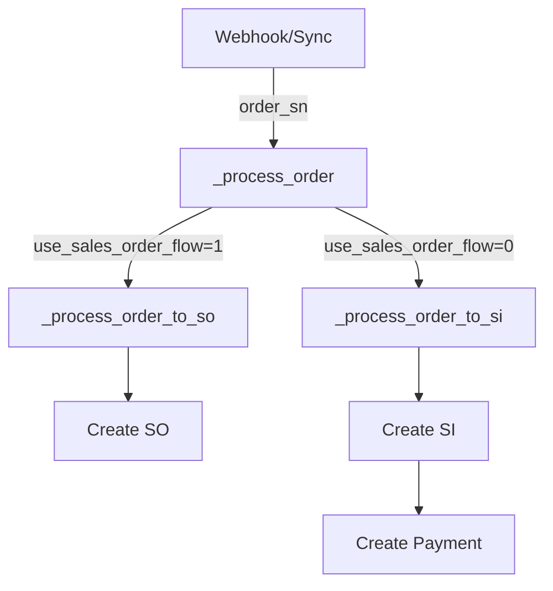
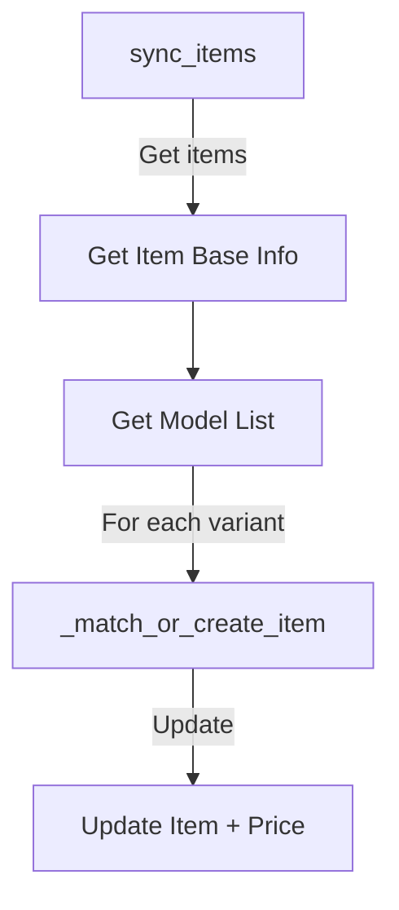

# Copilot Instructions for Shopee Bridge

This document guides AI assistants in wo## System Architecture

### 1. API Integration (`api.py`)

Core functions:
```python
def _call(path, partner_id, partner_key, shop_id=None, access_token=None, params=None):
    """All API calls go through here. Debug by checking:
    1. Request URL formation
    2. Signature generation
    3. Response handling"""

def _settings():
    """Central settings access. Debug configuration issues here"""

def _base():
    """API URL based on environment. Check Test vs Production URLs"""
```

Common error points:
- Signature mismatch
- Token expiration
- API rate limits
- Network timeouts

### 2. Document Creation

Order Documents:
```python
def _process_order_to_so(order_sn):
    """Debug points:
    1. Order detail API response
    2. Customer mapping
    3. Item resolution
    4. Stock validation"""

def _process_order_to_si(order_sn):
    """Similar to SO but adds:
    1. Payment entry creation
    2. Stock update handling"""
```

Item Management:
```python
def _match_or_create_item(it, rate):
    """Debug points:
    1. SKU matching logic
    2. Item creation fallbacks
    3. Custom field mapping"""
```

### 3. Data Migration

Migration Control:
```python
def migrate_completed_orders_execute(start_date, end_date, batch_size=50):
    """Debug points:
    1. Migration mode settings
    2. Batch processing
    3. Error handling per batch"""
```

Common Issues:
- Duplicate prevention
- Stock update conflicts 
- Database deadlocksee Bridge codebase, an ERPNext integration for Shopee e-commerce platform.

## Debug Guide by Function

### 1. OAuth Flow Debugging



Debug points:
1. URL Generation (`connect_url`):
   - Check partner_id and partner_key in Shopee Settings
   - Verify signature generation in `_sign()`
   - Validate redirect URL configuration

2. Token Exchange (`oauth_callback`, `exchange_code`):
   - Log request/response in `_call()`
   - Check error responses from Shopee API
   - Verify token storage in settings

3. Token Refresh (`refresh_if_needed`):
   - Monitor token expiration via `token_expire_at`
   - Check refresh token validity
   - Verify new token storage

### 2. Order Processing Flow



Debug points:
1. Order Detection:
   - Webhook payload in `webhook_handler`
   - Sync parameters in `sync_recent_orders`
   - Order status filtering

2. Order Processing:
   - Order details API response
   - Customer creation/mapping
   - Item code resolution
   - Stock availability checks

3. Document Creation:
   - Duplicate prevention via po_no
   - Item creation fallbacks
   - Payment entry creation

### 3. Item Sync Flow



Debug points:
1. API Calls:
   - Base item info response
   - Model/variant details
   - Price information

2. Item Creation:
   - SKU generation logic
   - Mapping fields update
   - Price list updates

## Project Overview

### 1. API Layer (`api.py`)
- Core API interaction with Shopee using `_call()` helper
- OAuth2 flow handled by `connect_url()` and `oauth_callback()`
- Order processing via `_process_order()` which routes to either:
  - `_process_order_to_so()` for Sales Order flow
  - `_process_order_to_si()` for direct Sales Invoice flow

### 2. Settings (`shopee_bridge/doctype/shopee_settings/`)
- Stores credentials and configuration
- Key fields: partner_id, partner_key, shop_id, environment
- Controls flow selection via `use_sales_order_flow`
- Migration mode settings for historical data import

### 3. Webhooks (`webhook.py`)
- Handles real-time order updates from Shopee
- Creates payment entries automatically
- Logs webhook data for debugging

## Troubleshooting Guides

### 1. API Connection Issues

Check in sequence:
```python
# 1. Settings validation
s = _settings()
if not s.partner_id or not s.partner_key:
    # Configuration incomplete

# 2. API URL formation
base_url = _base()  # Check environment setting

payload = f"{partner_id}{path}{ts}{access_token or ''}{shop_id or ''}"
sign = _sign(partner_key, payload)  # Compare with Shopee's error message

# 4. Response handling in _call()
if data.get("error"):
    # Check error code and message
```

### 2. Order Sync Problems

Debug flow:
```python
# 1. Check webhook reception
@frappe.whitelist(allow_guest=True)
def webhook_handler():
    # Verify signature
    # Extract order_sn

# 2. Verify order processing
def _process_order(order_sn):
    # Monitor API calls

# 3. Document creation issues
def _create_or_get_customer(order_detail):
    # Item resolution
    # Fallback creation
```
### 3. Migration Debugging

Key points:
```python
# 1. Migration mode check
s.migration_cutoff_date = frappe.utils.today()
# 2. Batch processing monitoring
def migrate_completed_orders_execute():
    # Log errors separately
    # Monitor performance

# 3. Stock updates
else:
    # Normal stock flow
```
1. Setup:
```bash
cd $BENCH_DIR
bench install-app shopee_bridge
```

- Pre-commit hooks for formatting (ruff, eslint, prettier)
- Run `pre-commit install` in the repo root

- Unit tests in `tests/` directory
- Test webhooks via `test_webhook()` function

## Common Integration Points
1. ERPNext Doctypes:
- Sales Order
- Sales Invoice
- Item
- Customer
- Payment Entry

2. Shopee API Endpoints:
- `/api/v2/shop/auth_partner` - OAuth
- `/api/v2/order/get_order_detail` - Order fetching
- `/api/v2/payment/get_escrow_detail` - Payment processing

## Error Handling Patterns

1. Use `_short_log()` for concise error logging:
```python
_short_log(f"Failed to process order {order_sn}: {e}", "Shopee Order Processing")
```

2. Implement retries for database operations:
```python
_insert_submit_with_retry(doc, max_tries=3, sleep_base=1.0)
```

## Migration Utilities

- `migrate_completed_orders_execute()` - Batch migration with migration mode
- Toggle migration mode to control stock updates
- Use `migration_cutoff_date` for historical data

## Scheduling

Configured in `hooks.py`:
```python
scheduler_events = {
    "cron": {
        "*/15 * * * *": [
            "shopee_bridge.api.scheduled_token_refresh",
            "shopee_bridge.api.scheduled_order_sync"
        ],
        "0 2 * * *": [
            "shopee_bridge.api.scheduled_item_sync"
        ]
    }
}
```
